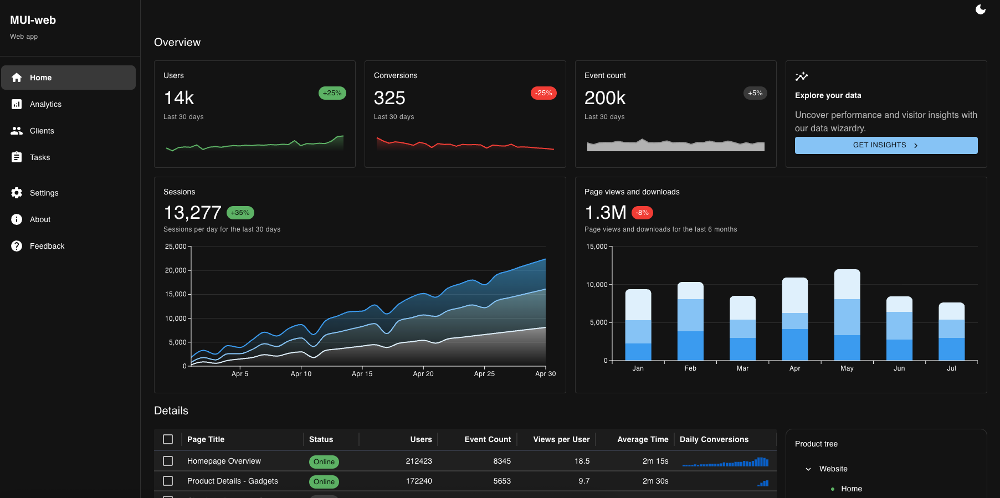
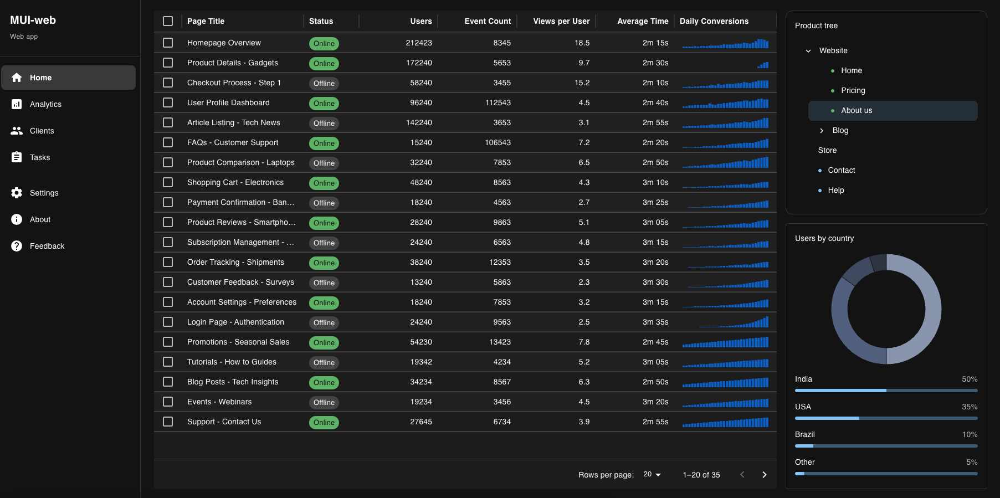
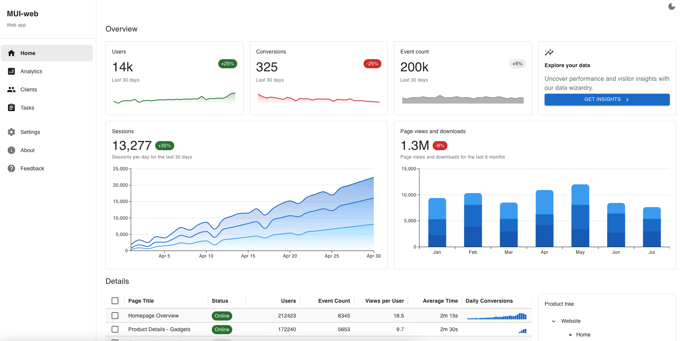
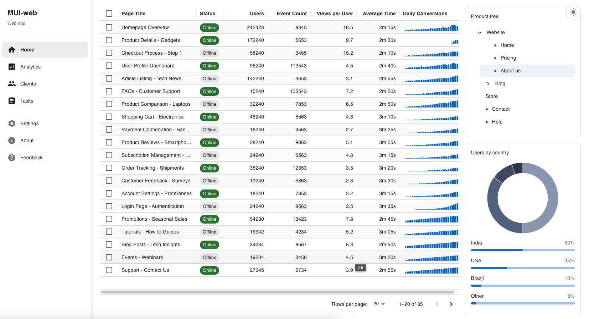

# 📊 MUI Analytics Dashboard

A modern, responsive analytics dashboard built with **React** and
**Material UI (MUI)**.\
This project demonstrates advanced UI patterns, data visualization, and
custom component styling using MUI and MUI X.

---

## 🚀 Overview

This dashboard replicates a real-world SaaS analytics interface with:

- Advanced data tables
- Interactive charts
- Collapsible navigation tree
- Country-based analytics visualization
- Theme-aware styling (Dark / Light mode)
- Clean, scalable component architecture

---

## ✨ Core Features

### 📋 Advanced Data Grid

- Checkbox row selection
- Pagination
- Compact density
- Status indicators (Online / Offline)
- Sparkline charts inside table cells
- Custom header and row styling
- Hover effects
- Dark mode support

### 📈 Analytics Charts

- Sessions Line/Area Chart
- Page Views Bar Chart
- Smooth gradient styling
- Responsive chart sizing
- Clean tooltip behavior

### 🌳 Product Tree

- Expand / Collapse functionality
- Nested hierarchy (Website → Blog → Posts)
- Custom dot indicators for node types
- Selected state styling
- Keyboard-friendly interaction

### 🌍 Users by Country

- Donut (Pie) Chart visualization
- Center total label
- Country breakdown with percentage
- Styled progress indicators
- Clean legend-free layout

### 🌙 Theme Support

- Fully theme-aware components
- Dark mode optimized UI
- Uses MUI theme palette properly
- No hardcoded colors (where avoidable)

---

## 🖥️ Running the Project

```bash
npm install
npm start
```

The app runs at:

http://localhost:3000

---

## 📸 Output

<p align="center">
  
  
</p>

<p align="center">
  
  
</p>
